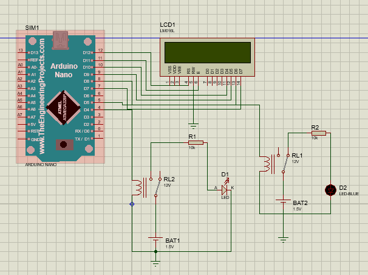

<h1> Introdução a RTOS</h1>
<ul>

RTOS significa "Real-Time Operating System" (Sistema Operacional em Tempo Real, em tradução livre) e é um tipo de sistema operacional projetado para aplicações que exigem resposta em tempo real. Neste contexto, "tempo real" significa que as operações devem ser concluídas dentro de prazos estritos e previsíveis, garantindo que as tarefas sejam executadas no momento exato em que são necessárias.

Os sistemas operacionais em tempo real são amplamente utilizados em uma variedade de aplicações, como sistemas de controle industrial, automação, dispositivos médicos, sistemas de aviação e automotivos, entre outros. Eles são projetados para lidar com requisitos de tempo real, como prazos rígidos, latência mínima, determinismo e escalonamento de tarefas.

É um pequeno microcontrolador desenvolvido com a capacidade de proporcionar comunicação sem fio através do Wifi e através do próprio sistema Bluetooth. Seu pequeno tamanho e a sua grande eficiência fazem com que este dispositivo destaca-se dentre tantos outros.

</ul>
<h1> Multitarefa com FreeRTOS</h1>
<ul>

O FreeRTOS (Real-Time Operating System) é um sistema operacional de tempo real de código aberto que é amplamente utilizado em sistemas embarcados e dispositivos com restrições de recursos. Embora o FreeRTOS seja um sistema operacional de tempo real, ele também suporta multitarefa, permitindo a execução concorrente de várias tarefas.

No FreeRTOS, as tarefas são a unidade básica de execução. Cada tarefa possui sua própria pilha e contexto de registro e pode ser programada para ser executada em intervalos de tempo regulares ou quando ocorre um evento específico. O escalonador do FreeRTOS é responsável por determinar qual tarefa será executada em um determinado momento, com base em sua prioridade.

</ul>

<h1> Sincronização de tarefas</h1>
<ul>

A sincronização de tarefas é necessária quando há compartilhamento de recursos ou troca de dados entre as tarefas, e é importante garantir que o acesso a esses recursos seja feito de forma segura e consistente. Em um ambiente de produção mais complexo, é comum ter tarefas que precisam se coordenar e cooperar para evitar condições de corrida, inconsistências de dados ou outros problemas relacionados à concorrência.

Por exemplo, se as duas tarefas precisassem acessar uma variável compartilhada, poderia haver um problema de leitura/gravação concorrente, levando a resultados inesperados. Nesse caso, seria necessário implementar algum mecanismo de sincronização, como um semáforo, mutex ou outra forma de exclusão mútua, para garantir que apenas uma tarefa por vez acesse a variável compartilhada.

Um semáforo pode ser usado para controlar o acesso concorrente a um recurso, permitindo que apenas uma tarefa por vez execute uma determinada seção crítica do código. Ele pode ser usado para evitar condições de corrida e garantir a consistência dos dados.

</ul>

<h1> Reações baseadas em condições de tempo real.</h1>
<ul>

#include <Arduino.h> //Inclui as bibliotecas necessárias para o programa, como a biblioteca do Arduino, FreeRTOS e LiquidCrystal.
#include <Arduino_FreeRTOS.h>
#include <LiquidCrystal.h>

#define LED_PINO_1 12 //Define constantes para os pinos dos LEDs.
#define LED_PINO_2 4
#define LED_PINO_3 5
void TaskReadTemperature(void *pvParameters);
void TaskBlink2(void *pvParameters); //Declaração dos protótipos das funções das tarefas.
void TaskBlink3(void *pvParameters);

LiquidCrystal lcd(12,11,10,9,8,7); //Inicializa o objeto lcd do tipo LiquidCrystal com os pinos correspondentes ao display LCD.
// protótipos para as tarefas
void TaskReadTemperature(void *pvParameters); // Variável para armazenar a temperatura lida
volatile float temp = 0.0;
volatile float vlr_acende = 26.0;
//Função de configuração (setup) do Arduino. Configura os pinos dos LEDs como saídas, inicia a comunicação serial e o display LCD. Em seguida, cria as tarefas TaskReadTemperature, TaskBlink2 e TaskBlink3 com suas respectivas prioridades.
void setup() {

pinMode(LED_PINO_1, OUTPUT);//INICIALIZAR OS PINOS DO LED'S COMO SAIDAS
pinMode(LED_PINO_2, OUTPUT);//INICIALIZAR OS PINOS DO LED'S COMO SAIDAS
pinMode(LED_PINO_3, OUTPUT);//INICIALIZAR OS PINOS DO LED'S COMO SAIDAS

 Serial.begin(9600);
 lcd.begin(16,2);

 // cria as tarefas
 xTaskCreate(
 TaskReadTemperature,
 "ReadTemperature",
 128,
 NULL,
 3,
 NULL );
//Crie as outras tarefas aqui

//Criar tarefas
xTaskCreate(
  TaskBlink2, //Função da tarefa - Ponteiro
  "Blink2",
  128, //tamanho da pilha
  NULL, //Parametro da tarefa
  5, //prioridade - numeros mais altos - proporcional a priporidade 
  NULL);//Agendar tarefa

xTaskCreate(
  TaskBlink3, //Função da tarefa - Ponteiro
  "Blink3",
  128, //tamanho da pilha
  NULL, //Parametro da tarefa
  6, //prioridade - numeros mais altos - proporcional a priporidade 
  NULL);//Agendar tarefa

}

//Função de loop (loop) vazia, pois o loop principal é gerenciado pelo FreeRTOS.
void loop() {}

//Implementação da tarefa TaskReadTemperature. Lê um valor simulado de temperatura e o armazena na variável temp. Em seguida, atualiza o display LCD com o valor da temperatura.
void TaskReadTemperature(void *pvParameters) {
  (void) pvParameters;
  float sensorVlr = 0.0;
  for (;;) {
    // Aqui você normalmente leria o valor do sensor de temperatura.
    // Por simplicidade, vamos apenas simular um sensor variando a temperatura de -10 a 40.
    sensorVlr = -10.0 + (rand() % 51); // gera um número aleatório entre -10 e 40
    temp = sensorVlr;
    vTaskDelay(2000 / portTICK_PERIOD_MS); // aguarda por 2 segundos
    
    lcd.setCursor(0,0);
    lcd.print("Temp: ");
    lcd.print(temp);
    lcd.print(" C");
  }
}

//Implementação da tarefa TaskBlink2. Verifica se o valor de temp é igual a vlr_acende e acende ou apaga o LED no LED_PINO_2 com base nessa condição. A tarefa espera por 3 segundos antes de repetir o processo.
  void TaskBlink2(void *pvParameters){
  (void) pvParameters;
  for (;;){//loop infinito
    if (temp == vlr_acender) {
          digitalWrite(LED_PINO_2, HIGH); // ACENDE o LED
        } else {
          digitalWrite(LED_PINO_2, LOW); // APAGA o LED
        }
        vTaskDelay(3000 / portTICK_PERIOD_MS); // aguarda por 2 segundos
  }
}

  void TaskBlink3(void *pvParameters){
  (void) pvParameters;
  for (;;){//loop infinito
    digitalWrite(LED_PINO_3, HIGH);
    vTaskDelay(500 / portTICK_PERIOD_MS);//FUNÇÃO MILLIS RTOS
    digitalWrite(LED_PINO_3, LOW);
    vTaskDelay(500 / portTICK_PERIOD_MS);//FUNÇÃO MILLIS RTOS
  }
}

</ul>

<h1> Vantagens</h1>
<ul>

O uso de um sistema operacional em tempo real (RTOS) em aplicações de Internet das Coisas (IoT) oferece diversas vantagens. Aqui estão algumas das principais vantagens do uso de RTOS nas aplicações IoT:

Gerenciamento de tarefas: O RTOS permite a execução simultânea de várias tarefas concorrentes, possibilitando a execução de múltiplas operações simultaneamente. Isso é especialmente útil em aplicações IoT, onde várias funcionalidades precisam ser executadas de forma independente e concorrente, como a coleta de dados, o processamento, a comunicação e o controle de dispositivos.

Temporização e sincronização: O RTOS fornece mecanismos de temporização e sincronização que permitem o agendamento e a coordenação precisa das tarefas. Isso é essencial em aplicações IoT, onde a sincronização de eventos, a captura de dados em intervalos regulares e a resposta rápida a eventos em tempo real são críticas.
Portabilidade e escalabilidade: O RTOS é projetado para ser portátil, ou seja, pode ser executado em diferentes plataformas de hardware e arquiteturas. Isso permite que as aplicações IoT sejam desenvolvidas de forma independente do hardware específico, facilitando a portabilidade e a escalabilidade do sistema.

</ul>

<h1>💡Esquemático💡</h1>

<h1>Muito obrigada/o!</h1>
